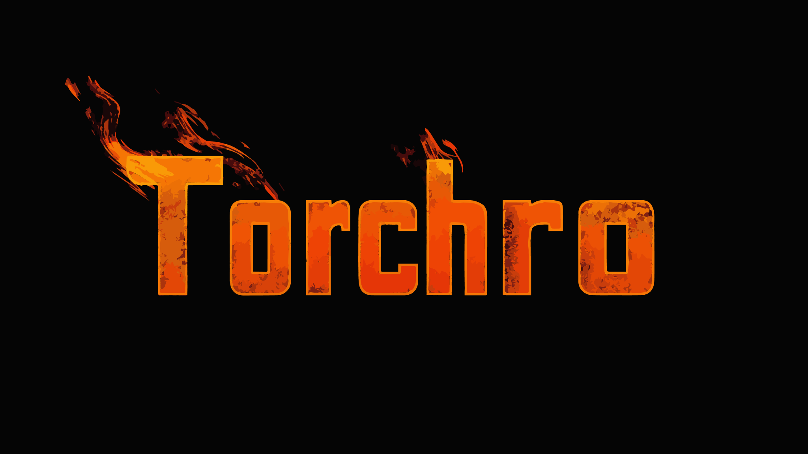

[](https://opensource.org/licenses/MIT)
[](https://github.com/invertase/melos)
[](https://app.renovatebot.com/dashboard)



# torchro-app

TBD

## Features

TBD

### Screenshots

TBD

## Get Started

`git clone` 後、以下のコマンドを実行します。

```shell
$ make bs
```

## Development Environment

TBD

## Architecture

- [Flutter](https://flutter.dev/)
- [Melos](https://melos.invertase.dev)

## Modularization

TBD

## Build

TBD

## Testing

TBD

## Performance

TBD

## License

torchro app is distributed under the terms of the MIT License. See the [license](LICENSE) for more
information.
